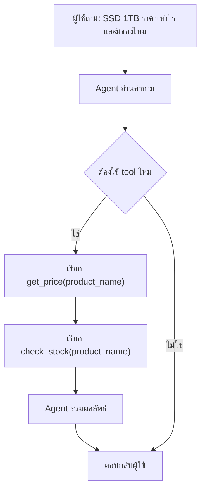

# Mini AI Agent Demo

โปรเจกต์นี้ทำมาเพื่อให้เห็นภาพ 3 อย่างแบบง่าย ๆ:

- `AI Agent` คืออะไร
- `Agent SDK` คืออะไร
- `Skill` คืออะไรในเชิงแนวคิด

## โครงสร้างไฟล์

- [demo_agent.py](/C:/GPTcoding/demo_agent.py) = agent แบบจำลอง ไม่ต้องใช้ API key
- [sdk_agent.py](/C:/GPTcoding/sdk_agent.py) = agent ที่ใช้ OpenAI Agents SDK
- [tools.py](/C:/GPTcoding/tools.py) = tools ที่ agent เรียกใช้
- [data/products.json](/C:/GPTcoding/data/products.json) = ฐานข้อมูลสินค้าตัวอย่าง
- [flow.mmd](/C:/GPTcoding/flow.mmd) = Mermaid flow diagram
- [requirements.txt](/C:/GPTcoding/requirements.txt) = package ที่ต้องใช้

## ภาพรวม

ผู้ใช้ถาม:

`SSD 1TB ราคาเท่าไร และมีของไหม`

สิ่งที่ agent ทำ:

1. อ่านคำถาม
2. ตัดสินใจว่าต้องใช้ tool อะไร
3. เรียก tool เช่น `get_price()` และ `check_stock()`
4. นำผลลัพธ์มาสรุปเป็นคำตอบ

## ความหมายของคำสำคัญ

### 1) AI Agent

ตัวที่รับคำสั่ง คิด และเลือกว่าจะใช้ tool อะไร

ในโปรเจกต์นี้:

- [demo_agent.py](/C:/GPTcoding/demo_agent.py) มี `SimpleShopAgent`
- [sdk_agent.py](/C:/GPTcoding/sdk_agent.py) มี `Agent(...)` จาก SDK

### 2) Tool

ฟังก์ชันที่ agent ใช้ทำงานจริง

ในโปรเจกต์นี้ tools อยู่ใน [tools.py](/C:/GPTcoding/tools.py):

- `find_product()`
- `get_price()`
- `check_stock()`

### 3) Agent SDK

framework ที่ช่วยให้เราสร้าง agent ได้สะดวกขึ้น

ในโปรเจกต์นี้:

- [sdk_agent.py](/C:/GPTcoding/sdk_agent.py) ใช้ `openai-agents`

### 4) Skill

คำนี้มี 2 มุมที่คนมักสับสน:

- เชิงแนวคิด: skill คือความสามารถเฉพาะด้าน เช่น "ตอบเรื่องสินค้า"
- ใน Codex: skill คือชุด workflow/คำแนะนำเฉพาะทางที่ Codex ใช้ช่วยทำงาน

ในตัวอย่างนี้ ถ้ามองเชิงแนวคิด:

- skill ของ agent คือ "ช่วยตอบคำถามเรื่องสินค้าโดยใช้ tools"

## วิธีรันแบบง่ายที่สุด

### แบบไม่ใช้ API key

```powershell
python demo_agent.py
```

## IEC 01 Cable App

- [index.html](/C:/GPTcoding/index.html) = เว็บแอปคำนวณขนาดสายไฟ IEC 01
- [styles.css](/C:/GPTcoding/styles.css) = ไฟล์ตกแต่งหน้าจอ
- [app.js](/C:/GPTcoding/app.js) = ข้อมูลกระแสและ logic คำนวณ

วิธีใช้งาน:

1. เปิด [index.html](/C:/GPTcoding/index.html) ด้วย browser
2. กรอกค่ากระแสไฟฟ้า `I`
3. เลือกขนาดสายไฟเป็น `sq.mm.`
4. ระบบจะแสดงสถานะสายที่เลือก และขนาดสายขั้นต่ำที่แนะนำ

ตัวนี้เหมาะที่สุดสำหรับเริ่มเข้าใจ flow

### แบบใช้ OpenAI Agents SDK

1. ติดตั้งแพ็กเกจ

```powershell
pip install -r requirements.txt
```

2. ตั้งค่า API key ใน PowerShell

```powershell
$env:OPENAI_API_KEY="sk-..."
```

3. รัน

```powershell
python sdk_agent.py
```

## ลองแก้เล่นเพื่อเข้าใจเร็วขึ้น

- เปลี่ยนข้อมูลใน [data/products.json](/C:/GPTcoding/data/products.json)
- เปลี่ยนคำถามใน [demo_agent.py](/C:/GPTcoding/demo_agent.py)
- เพิ่ม tool ใหม่ใน [tools.py](/C:/GPTcoding/tools.py) เช่น `recommend_product()`

## Mermaid Flow

ถ้า editor ของคุณรองรับ Mermaid ให้เปิด [flow.mmd](/C:/GPTcoding/flow.mmd)

หรือดูโค้ดด้านล่าง:


